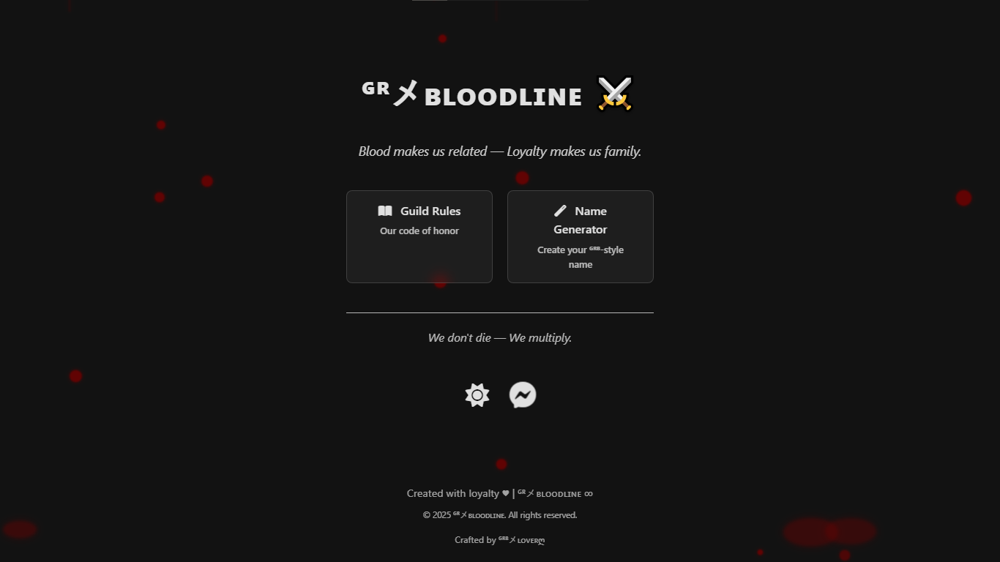

# ᴳᴿメʙʟᴏᴏᴅʟɪɴᴇ - Free Fire Guild Landing Page

Welcome to the official landing page of the **ᴳᴿメʙʟᴏᴏᴅʟɪɴᴇ** Free Fire guild — a family bound by loyalty, strength, and unity. This updated version brings a modern, polished look with enhanced functionality and fully responsive design.

---

## 🌐 Live Site

🔗 [Visit the Landing Page](https://gr-bloodline.github.io/home/)

---

## 🔥 Features

* ⚔️ Clean and modern layout with improved accessibility and readability
* 🌗 Automatic dark/light mode with updated multi-layer glow/shine effect on hover
* 💬 Messenger group link for easy community access
* 🧠 Name Generator and Guild Rules quick access
* 📱 Fully responsive and mobile-friendly design
* 🎨 Polished buttons with smooth hover animations and professional styling
* 📋 Copy-to-clipboard feature: clicking **“ᴳᴿᴮメʟᴏᴠᴇʀღ”** copies **3281874036**
* 🚫 Removed outdated double buttons and unnecessary restrictions for cleaner interactions
* ✨ Improved text color and glow contrast to work in both light and dark themes

---

## 📁 Project Structure

```
├── index.html
└── resource/
    ├── favicon.ico
    ├── icon.png
    └── preview.png
```

---

## 📷 Preview



---

## 📎 Useful Links

* 📘 [Guild Rules](https://gr-bloodline.github.io/rules/)
* ✨ [Name Generator](https://gr-bloodline.github.io/name-generator/)
* 💬 [Join Messenger Group](https://m.me/j/AbZMa7nzto1jC3fQ/)

---

**“Blood makes us related — Loyalty makes us family.”**

© 2025 ᴳᴿメʙʟᴏᴏᴅʟɪɴᴇ ∞ | Crafted with loyalty ♥ by ᴳᴿᴮメʟᴏᴠᴇʀღ
